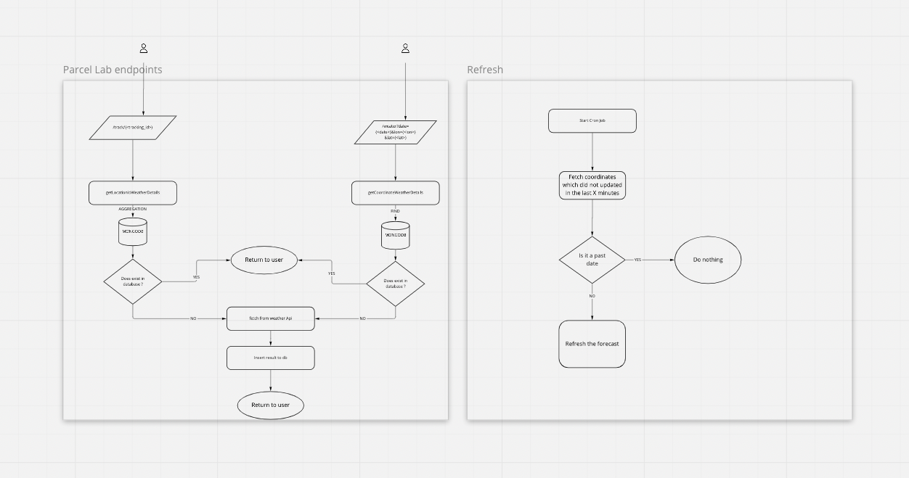

# Parcel Lab Challenge

https://parcellab.notion.site/parcelLab-Challenge-Backend-8aeaca33fd5a4e61af6efc2d86c5c107#e8caf250723f4f6abd1915f6ad5209d0

## Pipeline status:

## Prerequisites

Please make sure that you have `docker` and `yarn` installed. You can simply check with running these
commands `docker --version` `yarn --version`

### Running the application

This application is using Dockerized Backend with Dockerized mongodb. Before running the application, please make sure that the docker deamon is running.
To start the application with mongodb please
simply run the command `docker-compose up -d`. This will create 2 containers, one for the application and the other for
mongodb respectively.

If you have somehow docker not installed or if you have a problem about setting up the service you can run it in 3 steps.

1. Make sure that you have a mongodb up and running. 
2. Copy `.env.example` at root folder to `.env`
3. Run `yarn seed` to ensure that database is in initial state and populated from csv files
4. Run `yarn start` to start the service

### App Documentation

To see the detailed usage and the documentation of the app, please kindly use `/api-docs` end point. Api docs are written with swagger documentation.

## Work place structure

This application follows a monorepo approach. The following sections explain the folder structure:

-   `./db/`: Contains everything related to database, queries, seeders, models, csv's etc.
-   `./src/cron`: Contains things related to cron job, which periodically refreshes the db.
-   `./tests/unit`: Unit tests for the project.
-   `./tests/integration`: Integration test for the project
-   `./swagger.json`: Swagger object for documenting the application
-   `./.github/`: PR templates and GitHub Action definitions.
-   `.gitignore`: File and folder globs to be ignored by git.
-   `package.json`: The node package definition, with packages links and scripts.
-   `yarn.lock`: Auto generated lock file from yarn.
-   `./tests/jest.*.js`: Global jest config for testing.
-   `.prettier`: Config containing prettier files.
-   `.tsconfig.*`: Global typescript configuration.

### Application Architecture:

### Design decisions and explanations to the reviewer:

#### Language Selection

The application is written in typescript. The only reason I choose this is because of its type assistance and
similarities with node.js. Since node.js was recommended, I wanted to use something like node.js yet I wanted to make
use of the types. But reviewer can simply think that I was not enough type safe because the application has multiple
implicit `any`. But for the sake of the challenge, I only typed the things I need and which is often used.

#### Weather app

In this application, I used another weather application than suggested. I took this decision only because this app was
easier to use and data was easier to fetch. All the data which are provided is for free in the meanwhile suggested app
required a paid subscription to get historical and statistical data.

#### Refresh Mechanism

There were many approaches that I considered while I was writing this code. But for the sake of this challenge I went
for the easy approach. A Cron job runs every 5 minutes, checks the results, which did not update lately. If it's a date
in the future, it re-fetches the forecast. If it's in the past, it skips.

#### Testing

I used a simple behaviour driven test approach for the integration tests. I wrote the tests depending on the reviewer's behavior first and then I
implemented the code inside. Due to the time limitation, I could not add extra flavors to the tests but rather keep the
coverage as high as possible. At the end of testing marathon, I was able to achieve %100 percent test coverage. Integration tests requires that you have local mongodb running. 
To run integration tests please run `yarn test:integration`. To run unit tests, please run `yarn test:unit`.

### Future Improvements:

Here in this application I did not take care of timezone, caller can be simply from a different time zone or requested
location can be. But for the sake of the challenge I simply assumed that there is only one timezone.
